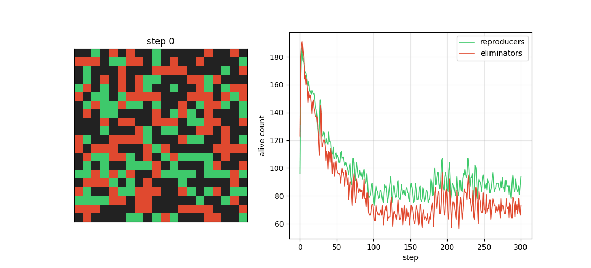

# Neural State-Aware Cellular Automaton

A 2D cellular automaton where each cell has a goal (reproduce or eliminate) and its own tiny MLPs. Survival is a **fixed global rule** that cells cannot change but learn to exploit.



*20×20 grid, 300 steps. Green = alive reproducer, red = alive eliminator, dark = dead.*

## How it works

Each cell $i$ holds an alive flag $x_i$, an observable state $s_i$, a memory $h_i$, a goal $g_i \in \{\text{reproduce}, \text{eliminate}\}$, and a communication rate $\rho_i$. Two per-cell 1-hidden-layer MLPs run every step:

- **ψ** (message): on each outgoing Moore edge, emit a message vector plus typed votes $v_{\text{help}}$ (kin) and $v_{\text{harm}}$ (foe).
- **f** (local update): propose a next $(s, h)$ from the cell's own state and the aggregated incoming messages.

The survival probability is a logistic of neighbourhood counts, routed votes, and a bounded *f-signal*:

$$
p_i = \sigma\!\big(
  w_0 + w_1 A_i + w_2 R_i + w_3 E_i
  + w_4^{\text{help}} V^{\text{kin}}_i
  + w_4^{\text{harm}} V^{\text{foe}}_i
  + w_5 \tanh(\mathbf{u}\cdot\tilde{s}_i)
\big)
$$

$A_i, R_i, E_i$ are alive / reproducer / eliminator neighbour counts. $V^{\text{kin}}$ / $V^{\text{foe}}$ are ρ-gated vote sums from same-goal vs opposite-goal neighbours. $\tilde{s}_i$ is *f*'s proposed next state; $\mathbf{u}$ is a fixed projection (sampled from `u_seed`). Hard update: $x_i \leftarrow 1[p_i > 0.5]$.

Local loss (both types want themselves alive; they differ on neighbours):

$$
\ell_i = -p_i + \sum_{k \in \mathcal{N}(i)} c_{i,k}\, p_k
$$

Reproducers protect kin and pressure foes. Eliminators pressure everyone by default, or only prey when `predator_prey_loss` is on. SGD is per-cell and per-step; `learn=False` skips the gradient step entirely (both ψ and *f* stay frozen).

**Locality.** Neighbour contributions to $p$ are detached except for this cell's own vote / f-signal. `loss.sum().backward()` therefore fills only that cell's parameter slot. The message-vector head of ψ is frozen under the default Path-1 detaches (`learn_messages=False`); votes and the f-signal are the trained channels.

Weights $w_0\ldots w_5$, goals (unless inheritance is on), $\rho$, and $\mathbf{u}$ are fixed at init. A single `Config.seed` makes a run bit-exact.

## Ablation flags

Config flags (also in the UI) isolate paper versions on a shared seed:

| Flag | Version | Effect |
| --- | --- | --- |
| `typed_votes` | A (default on) | Help/harm votes routed by kin vs foe |
| `predator_prey_loss` | B | Eliminators only pressure reproducer neighbours |
| `goal_inheritance` | C | Birth cells adopt majority neighbour goal |
| `goal_in_f` | D | Own goal is an input to *f* |
| `coexistence_pressure` | F | Soft barrier on both types' living mass |

`original` is typed votes off (one indiscriminate vote channel). `E` is A plus symmetric $w_2=w_3$. See [`research/README.md`](research/README.md) for the full registry (`C_only`, `D_fixed`, …).

**Experiment G** (frozen spatial maps: occupancy / κ / η-scale) is implemented in `environment.py` but was **not included in the report**. The interactive UI hides those controls. You can still enable it from a Config JSON via `python run.py --config …`.

## Project structure

```
config.py              # hyperparameters, seed, version flags
parameters.py          # per-cell ψ / f MLP weights, batched forward
state.py               # x, s, h, goals, rho
grid.py                # Grid container, toroidal Moore-8 gather
dynamics.py            # message pass, local update, survival
learning.py            # per-cell loss, locality SGD
environment.py         # Experiment G overlay (frozen maps)
simulate.py            # init → steps → trajectory.npz
visualise.py            # summary / animation / final grid
run.py                  # CLI
server.py               # interactive UI
simulation_engine.py    # background tick thread for the UI
ui_config.py             # UI field metadata
discover.py               # guided / random config search
discovery/               # catalog, prefilter, VLM judge
research/                 # paper versions, suite, thesis pipeline
experiments/              # one-off scientific probes
tests/                    # unit tests
static/                   # UI frontend
```

## Quick start

```bash
pip install torch numpy matplotlib
python run.py --visualise                         # defaults
python run.py --seed 7 --n-steps 500 --visualise  # overrides
python run.py --config path/to/config.json --visualise
```

Writes `runs/<name>/` with `config.json`, `trajectory.npz`, `params_final.pt`, and (with `--visualise`) `summary.svg` plus `animation.gif`. Extra plots: `--final-grid`, `--alive-count`.

```bash
python -m pytest tests/ -q
```

## Interactive UI

```bash
pip install fastapi uvicorn websockets
python server.py
# open http://127.0.0.1:8765
```

Sidebar sliders for Config fields used in the report (A–F); start / pause / reset; live grid and counters; speed control; download-current-config. Blank `n_steps` runs indefinitely. New fields appear automatically once listed in `UI_FIELDS` (`ui_config.py`).

Experiment G terrain controls (presets, custom regions, click-to-paint islands) are commented out of the UI because G is extra relative to the report. The engine still supports them; uncomment the G block in `ui_config.py` / `static/index.html` to restore.

## Automated config discovery

Search with learning on: simulate → prefilter obvious crashes → **Gemini Flash** judges the summary plot and proposes the next config. `--no-guided` is pure random; `--dry-run` uses a heuristic instead of the API.

```bash
pip install -r requirements-discovery.txt
export GEMINI_API_KEY=...          # or GOOGLE_API_KEY, or a .env file

python discover.py --max-cycles 30 --target-discoveries 5
python discover.py --no-guided --max-cycles 30 --target-discoveries 5
python discover.py --max-cycles 10 --dry-run --n-steps 500

# Force a paper version; seed-only search keeps weights frozen
python discover.py --version C --max-cycles 30 --target-discoveries 5
python discover.py --version E --seed-only \
  --base-config research/configs/benchmark_sym_w.json \
  --target-discoveries 15 --max-cycles 400
```

Saved finds go under `discoveries/` (or `discoveries_<version>/`) with `catalog.md`. Re-run one with:

```bash
python run.py --config discoveries/disc_0001/config.json --visualise
```

## Research comparisons

Pairwise isolations, spatial frames, paired tests, and four-chunk reports:

```bash
python -m research.pipeline list
python -m research.pipeline run --quick    # smoke
python -m research.pipeline run            # frozen protocol (slow)
```

Ad-hoc version lists still use the suite:

```bash
python -m research.suite list
python -m research.suite run --versions original,A
python -m research.suite run --quick
```

Results land in `research_results/<run>/` (`INDEX.md` for the pipeline, `REPORT.md` for the suite). Details: [`research/README.md`](research/README.md).

Standalone probes (`python -m experiments.exp1_frozen_vs_trained`, …) live in [`experiments/`](experiments/README.md).
